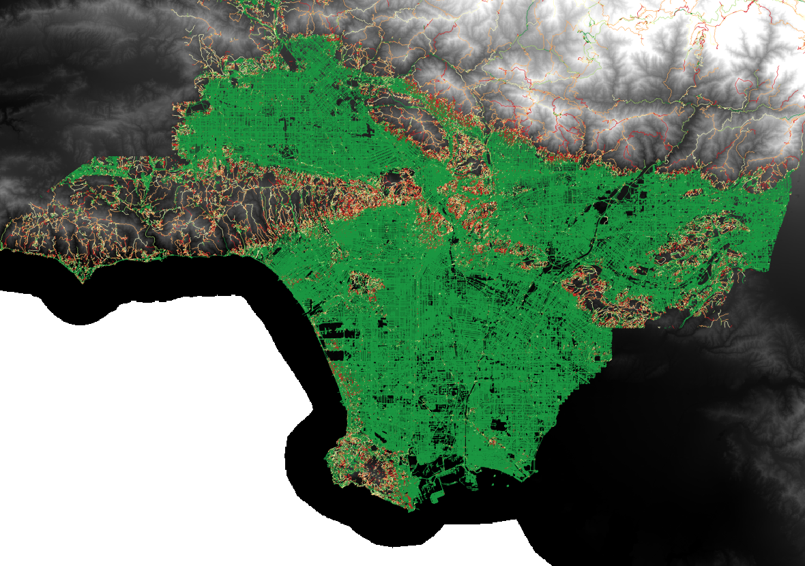
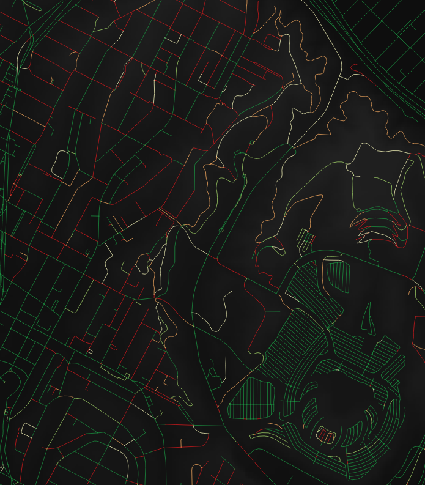

# ladot_analysis_dataprep
LADOT Analysis Tool Data Prep

This repository houses a Python script (**osm_generalized_costs.py**) designed to generate OSM-based, generalized cost-weighted networks for use in bicycle and pedestrian routing and accessibility applications. The generalized cost formulas used here are based on [Broach (2016)](https://pdxscholar.library.pdx.edu/cgi/viewcontent.cgi?article=3707&context=open_access_etds).

## How to
1. Clone/download this repository.
2. Copy local data files<sup>&dagger;</sup> into the data directory, including:
   - stop signs
   - traffic signalization
   - bikeways
   - crosswalks
   - traffic volume and speed data
3. If working with a static, local OSM extract, put your your .osm file into the data directory as well.
4. To run the analysis with all defaults, simply navigate to the `scripts/` directory of this repository and run the following command:
   ```
   python osm_generalized_costs.py 
   ```
4. To use a local .osm instead of pulling OSM data from nominatim on-the-fly, you can use the `-o` flag:
   ```
   python osm_generalized_costs.py -o <your_osm_file.osm>
   ```
5. If you've already run this script before, you can save time by using the `-d` flag and pointing the script to the elevation data (DEM) .tif that was generated on-the-fly last time the script was run:
   ```
   python osm_generalized_costs.py -o <your_dem_file.tif>
   ```
7. The script will then generate an OSM XML file with the computed attributes stored as new OSM way tags. The following new tags are created by default:
   - `gen_cost_bike:forward:left`
   - `gen_cost_bike:forward:straight`
   - `gen_cost_bike:forward:right`
   - `gen_cost_bike:backward:left`
   - `gen_cost_bike:backward:straight`
   - `gen_cost_bike:backward:right`
   - `gen_cost_ped:forward:left`
   - `gen_cost_ped:forward:straight`
   - `gen_cost_ped:forward:right`
   - `gen_cost_ped:backward:left`
   - `gen_cost_ped:backward:straight`
   - `gen_cost_ped:backward:right`
   - `speed_peak:forward`
   - `speed_offpeak:forward`
   - `speed_peak:backward`
   - `speed_offpeak:backward`
   - `aadt`

8. If you would rather store your output as ESRI shapefiles, simply use the `-s` flag and the script will generate two sets of shapefiles for the node and edge data, with generalized cost attributes stored in the edges. 
   ```
   python osm_generalized_costs.py -s shp
   ```

<sup>&dagger;</sup>Note: Generalized cost generation can be executed without the use of local data by running the script with the `-i` (no infrustructure data) or `-v` (no volume/speed data) flags. If you do want to use local data but your filenames are different from those specified at the top of the script, you can edit them manually there.

## Generalized Costs Calculations
### Bicycle

|Computed Metric	|Weight<sup>*</sup>	|Applicable Directions|	Applicable Turn Types|	Variable Name |	Notes|
|--|--|--|--|--|--|
|turns/mi | 0.042 | forward, backward | left, right | turn_penalty | |
|bike boulevard | -0.108 | forward, backward | left, straight, right | bike_blvd_penalty | OSM: cycleway="shared" OR LADOT: bikeway=("Route" OR "Shared Route")|
|bike path | -0.16 | forward, backward | left, straight, right | bike_path_penalty | OSM: highway="cycleway" OR (highway="path" & bicycle="dedicated") OR LADOT: bikeway="Path"|
|stop signs/mi | 0.005 | forward | left, straight, right | stop_penalty:forward | (LADOT: stop/yield) | (OSM: highway=stop)|
|traffic signal | 0.021 | forward | left, straight | signal_penalty:forward | (LADOT: signalized intersection) | (OSM: highway=traffic_signals)|
|prop upslope 2-4% | 0.371 | forward | left, straight, right | slope_penalty:forward | |
|prop upslope 4-6% | 1.23 | forward | left, straight, right | slope_penalty:forward | |
|prop upslope 6%+ | 3.239 | forward | left, straight, right | slope_penalty:forward | |
|stop signs/mi | 0.005 | backward | left, straight, right | stop_penalty:backward | (LADOT: stop/yield) | (OSM: highway=stop)|
|traffic signal | 0.021 | backward | left, straight | signal_penalty:backward | (LADOT: signalized intersection) | (OSM: highway=traffic_signals)|
|prop downslope 2-4% | 0.371 | backward | left, straight, right | slope_penalty:backward | |
|prop downslope 4-6% | 1.23 | backward | left, straight, right | slope_penalty:backward | |
|prop downslope 6%+ | 3.239 | backward | left, straight, right | slope_penalty:backward | |
|parallel traffic (10-20k) | 0.091 | forward, backward | left | parallel_traffic_penalty | |
|parallel traffic (20k+) | 0.231 | forward, backward | left | parallel_traffic_penalty | |
|no bike lane (10-20k) | 0.368 | forward, backward | left, straight, right | no_bike_penalty:forward | OSM: cycleway=(NULL OR "no") OR OSM: bicycle="no" AND LADOT: bikeway=NULL|
|no bike lane (20-30k) | 1.4 | forward, backward | left, straight, right | no_bike_penalty:forward | OSM: cycleway=(NULL OR "no") OR OSM: bicycle="no" AND LADOT: bikeway=NULL|
|no bike lane (30k+) | 7.157 | forward, backward | left, straight, right | no_bike_penalty:forward | OSM: cycleway=(NULL OR "no") OR OSM: bicycle="no" AND LADOT: bikeway=NULL|
|cross traffic (5-10k) | 0.041 | forward | left, straight | cross_traffic_penalty_ls:forward | |
|cross traffic (10-20k) | 0.059 | forward | left, straight | cross_traffic_penalty_ls:forward | |
|cross traffic (20k+) | 0.322 | forward | left, straight | cross_traffic_penalty_ls:forward | |
|cross traffic (10k+) | 0.038 | forward | right | cross_traffic_penalty_r:forward | |
|cross traffic (5-10k) | 0.041 | backward | left, straight | cross_traffic_penalty_ls:backward | |
|cross traffic (10-20k) | 0.059 | backward | left, straight | cross_traffic_penalty_ls:backward | |
|cross traffic (20k+) | 0.322 | backward | left, straight | cross_traffic_penalty_ls:backward | |
|cross traffic (10k+) | 0.038 | backward | right | cross_traffic_penalty_r:backward | |

<sup>*</sup>Variable weights are derived from Broach (2016) commute-based weights

|Generalized Cost	| Formula|
|--|--|
|gen_cost_bike:forward:left | distance + distance * (slope_penalty:forward + stop_penalty:forward + bike_blvd_penalty + bike_path_penalty + signal_penalty:forward + turn_penalty + no_bike_penalty + parallel_traffic_penalty + cross_traffic_penalty_ls:forward) |
|gen_cost_bike:forward:straight | distance + distance * (slope_penalty:forward + stop_penalty:forward + bike_blvd_penalty + bike_path_penalty + signal_penalty:forward  + no_bike_penalty + cross_traffic_penalty_ls:forward) |
|gen_cost_bike:forward:right | distance + distance * (slope_penalty:forward + stop_penalty:forward + bike_blvd_penalty + bike_path_penalty + turn_penalty  + no_bike_penalty + cross_traffic_penalty_r:forward) |
|gen_cost_bike:backward:left | distance + distance * (slope_penalty:backward + stop_penalty:forward + bike_blvd_penalty + bike_path_penalty + signal_penalty:backward + turn_penalty + no_bike_penalty + parallel_traffic_penalty + cross_traffic_penalty_ls:backward) |
|gen_cost_bike:backward:straight | distance + distance * (slope_penalty:backward + stop_penalty:forward + bike_blvd_penalty + bike_path_penalty + signal_penalty:backward + no_bike_penalty + cross_traffic_penalty_ls:backward) |
|gen_cost_bike:backward:right | distance + distance * (slope_penalty:backward + stop_penalty:forward + bike_blvd_penalty + bike_path_penalty + turn_penalty + no_bike_penalty + cross_traffic_penalty_r:backward) |


### Pedestrian
|Length Adjusted Metric|	Weight<sup>*</sup>	|Applicable Directions	|Applicable Turn Types	|Variable Name	|Notes|
|--|--|--|--|--|--|
prop upslope 10%+ | 0.99 | forward | left, straight, right | ped_slope_penalty:forward | 
prop downslope 10%+ | 0.99 | backward | left, straight, right | ped_slope_penalty:backward | 
unpaved or alleyway | 0.51 | forward, backward | left, straight, right | unpaved_alley_penalty | OSM: highway="alley" OR surface="unpaved"
busy street | 0.14 | forward, backward | left, straight, right | busy_penalty | OSM: highway=('tertiary' OR 'tertiary_link' OR 'secondary' OR 'secondary_link' OR 'primary' OR 'primary_link' OR 'trunk' OR 'trunk_link' OR 'motorway' OR 'motorway_link'
neighborhood commercial | -0.28 | forward, backward | left, straight, right | nbd_penalty | 

|Fixed Distance Metric|	Addt'l Distance (m)<sup>*</sup>	|Applicable Directions	|Applicable Turn Types	|Variable Name	|Notes|
|--|--|--|--|--|--|
turn | 54 | forward, backward | left, right | turn_penalty | 
unsignalized arterial crossing | 73 | forward | left, right | unsig_art_xing_penalty_lr:forward | ((13000 <= parallel traffic AADT <= 23000) OR (13000 <= self-edge AADT <= 23000)) AND (unsignalized)
unsignalized arterial crossing | 73 | forward | straight | unsig_art_xing_penalty_s:forward | (13000 <= cross traffic AADT <= 23000) AND (unsignalized)
unsignalized arterial crossing | 73 | backward | left, right | unsig_art_xing_penalty_lr:backward | ((13000 <= parallel traffic AADT <= 23000) OR (13000 <= self-edge AADT <= 23000)) AND (unsignalized)
unsignalized arterial crossing | 73 | backward | straight | unsig_art_xing_penalty_s:backward | (13000 <= cross traffic AADT <= 23000) AND (unsignalized)
collector crossing w/o crosswalk | 28 | forward | left, right | unmarked_coll_xing_penalty_lr:forward | ((10000 <= parallel traffic AADT < 13000) OR (10000 <= self-edge AADT < 13000)) AND (no crosswalk)
collector crossing w/o crosswalk | 28 | forward | straight | unmarked_coll_xing_penalty_s:forward | (10000 <= cross traffic AADT < 13000) AND (no crosswalk)
collector crossing w/o crosswalk | 28 | backward | left, right | unmarked_coll_xing_penalty_lr:backward | ((10000 <= parallel traffic AADT < 13000) OR (10000 <= self-edge AADT < 13000)) AND (no crosswalk)
collector crossing w/o crosswalk | 28 | backward | straight | unmarked_coll_xing_penalty_s:backward | (10000 <= cross traffic AADT < 13000) AND (no crosswalk)

<sup>*</sup>Variable weights and distances are derived from Broach (2016) commute-based weights

|Generalized Cost	| Formula|
|--|--|
|gen_cost_ped:forward:left | distance + distance * (slope_penalty:forward + unpaved_alley_penalty + busy_penalty + nbd_penalty) + (turn_penalty + unsig_art_xing_penalty_lr:forward + unmarked_coll_xing_lr:forward)|
|gen_cost_ped:forward:straight | distance + distance * (slope_penalty:forward + unpaved_alley_penalty + busy_penalty + nbd_penalty) + (turn_penalty + unsig_art_xing_penalty_s:forward + unmarked_coll_xing_s:forward)|
|gen_cost_ped:forward:right | distance + distance * (slope_penalty:forward + unpaved_alley_penalty + busy_penalty + nbd_penalty) + (turn_penalty + unsig_art_xing_penalty_lr:forward + unmarked_coll_xing_lr:forward)|
|gen_cost_ped:backward:left | distance + distance * (slope_penalty:backward + unpaved_alley_penalty + busy_penalty + nbd_penalty) + (turn_penalty + unsig_art_xing_penalty_lr:backward + unmarked_coll_xing_lr:backward)|
|gen_cost_ped:backward:straight | distance + distance * (slope_penalty:backward + unpaved_alley_penalty + busy_penalty + nbd_penalty) + (turn_penalty + unsig_art_xing_penalty_s:backward + unmarked_coll_xing_s:backward)|
|gen_cost_ped:backward:right | distance + distance * (slope_penalty:backward + unpaved_alley_penalty + busy_penalty + nbd_penalty) + (turn_penalty + unsig_art_xing_penalty_lr:backward + unmarked_coll_xing_lr:backward)|

## Slope Computations

^ above: LA County road network colored by mean absolute slope along each OSM way.

### Examples
The following images show the LA county OSM roads colored from green to red based on the percentage of each OSM way that has a slope >= 6%:

1. This county-wide map shows roads with the highest percentage of slopes >6% clustered around the the foothills of the Santa Monica and San Gabriel mountain ranges, as expected:

2. A more detailed view shows the severity of the slopes of streets leading down to sea level near Manhattan Beach:

3. A third image highlights the slopes of roads to the NW of Dodger Stadium, including the infamously inclined [Baxter Street](https://www.laweekly.com/this-super-steep-echo-park-street-is-hell-on-earth-for-cars/):  

 
 
 
